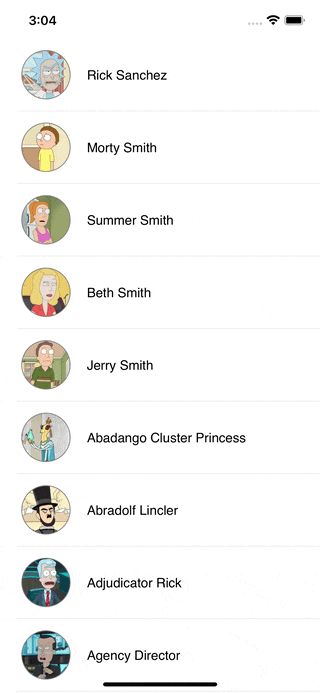
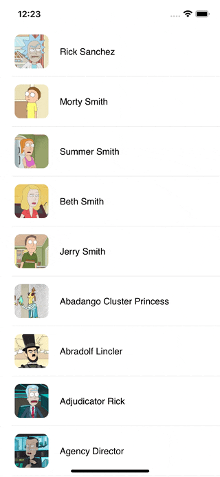

# Animation samples

## ✍️ About

This repo contains a bunch of animation UIKit sample to integrate in your projects. 

## 📋 Table of content

### UI Animation

### Transitions
Every view controller can have a transition delegate, in that delegate implementation you can provide the custom animation and interaction controllers. Those objects will be responsible for the actual animation process, and this delegate is the place where you can "inject your code" to the UIKit framework. 
[More info in Apple documentation](https://developer.apple.com/documentation/uikit/uiviewcontrollertransitioningdelegate)

- [Custom present controller ](#Custom-present-controller )
- [Custom transition from a tableViewCell](#Custom-transition-from-a-tableViewCell)

## 🎬 Transitions

### Custom present controller 
Custom transition for present controller. Using `UIViewControllerTransitioningDelegate` you can manipulate the transition between 2 viewcontrollers. In this case we have 2 viewcontrollers (A and B) where A is presenting B but we have change its behaviour to make it different. 

Expected behaviour             |  Modified behaviour       
:-------------------------:|:-------------------------:|
  |  

### Custom transition from a tableViewCell
Custom transition from an element. Using `UIViewControllerTransitioningDelegate` and a `NSObject` we can create an animation from a single element

Expected behaviour             |  Modified behaviour       
:-------------------------:|:-------------------------:|
  |  

## License
[MIT](https://choosealicense.com/licenses/mit/)